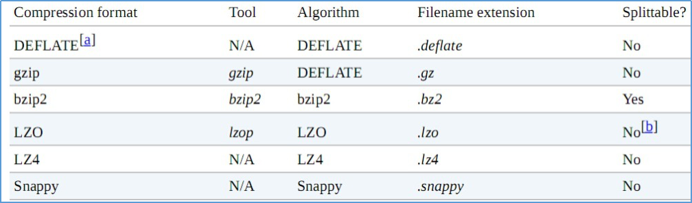

# hadoop学习笔记——NO.6_MapReduce_1

## 1.MapReduce原理篇（1）
MapReduce是一个分布式运算程序的编程框架，是用户开发"基于hadoop的数据分析应用"的核心框架。
Mapreduce核心功能是将用户编写的业务逻辑代码和自带默认组件整合成一个完整的分布式运算程序，并发运行在一个hadoop集群上。

### 1.1 为什么要MAPREDUCE
>1、海量数据在单机上处理因为硬件资源限制，无法胜任
2、而一旦将单机版程序扩展到集群来分布式运行，将极大增加程序的复杂度和开发难度
3、引入mapreduce框架后，开发人员可以将绝大部分工作集中在业务逻辑的开发上，而将分布式计算中的复杂性交由框架来处理

设想一个海量数据场景下的wordCount需求：

单机版：
内存受限，磁盘受限，运算能力受限

分布式：
>1、文件分布式存储（HDFS）
2、运算逻辑需要至少分成2个阶段（一个阶段独立并发，一个阶段汇聚）
3、运算程序如何分发
4、程序如何分配运算任务（切片）
5、两阶段的程序如何启动？如何协调？
6、整个程序运行过程中的监控？容错？重试？

可见在程序由单机版扩成分布式时，会引入大量的复杂工作。为了提高开发效率，可以将分布式程序中的公共功能封装成框架，让开发人员可以将精力集中于业务逻辑。

而mapreduce就是这样一个分布式程序的通用框架，其应对以上问题的整体结构如下：
>1、MRAppMaster(mapreduce application master)
2、MapTask
3、ReduceTask

### 1.2 MapReduce框架结构及核心运行机制
#### 1.2.1 结构
一个完整的mapreduce程序在分布式运行时有三类实例进程：
>1、MRAppMaster：负责整个程序的过程调度及状态协调
2、mapTask：负责map阶段的整个数据处理流程
3、ReduceTask：负责reduce阶段的整个数据处理流程

#### 1.2.2 MR程序运行流程
##### 1.2.2.1 流程示意图

##### 1.2.2.2 流程解析
1、一个mr程序启动的时候，最先启动的是MRAppMaster，MRAppMaster启动后根据本次job的描述信息，计算出需要的maptask实例数量，然后向集群申请机器启动相应数量的maptask进程

2、maptask进程启动之后，根据给定的数据切片范围进行数据处理，主体流程为：
a)利用客户指定的inputformat来获取RecordReader读取数据，形成输入KV对
b)将输入KV对传递给客户定义的map()方法，做逻辑运算，并将map()方法输出的KV对收集到缓存
c)将缓存中的KV对按照K分区排序后不断溢写到磁盘文件

3、MRAppMaster监控到所有maptask进程任务完成之后，会根据客户指定的参数启动相应数量的reducetask进程，并告知reducetask进程要处理的数据范围（数据分区）

4、Reducetask进程启动之后，根据MRAppMaster告知的待处理数据所在位置，从若干台maptask运行所在机器上获取到若干个maptask输出结果文件，并在本地进行重新归并排序，然后按照相同key的KV为一个组，调用客户定义的reduce()方法进行逻辑运算，并收集运算输出的结果KV，然后调用客户指定的outputformat将结果数据输出到外部存储


### 1.3 MapTask并行度决定机制
maptask的并行度决定map阶段的任务处理并发度，进而影响到整个job的处理速度
那么，mapTask并行实例是否越多越好呢？其并行度又是如何决定呢？

#### 1.3.1 mapTask并行度的决定机制
一个job的map阶段并行度由客户端在提交job时决定而客户端对map阶段并行度的规划的基本逻辑为：将待处理数据执行逻辑切片（即按照一个特定切片大小，将待处理数据划分成逻辑上的多个split），然后每一个split分配一个mapTask并行实例处理

这段逻辑及形成的切片规划描述文件，由FileInputFormat实现类的getSplits()方法完成，其过程如下图：

#### 1.3.2 FileInputFormat切片机制
1、切片定义在InputFormat类中的getSplit()方法
2、FileInputFormat中默认的切片机制：
a)简单地按照文件的内容长度进行切片
b)切片大小，默认等于block大小
c)切片时不考虑数据集整体，而是逐个针对每一个文件单独切片

比如待处理数据有两个文件：
>file1.txt    320M
file2.txt    10M

经过FileInputFormat的切片机制运算后，形成的切片信息如下：  
>file1.txt.split1--  0~128
file1.txt.split2--  128~256
file1.txt.split3--  256~320
file2.txt.split1--  0~10M

3、FileInputFormat中切片的大小的参数配置
通过分析源码，在FileInputFormat中，计算切片大小的逻辑：Math.max(minSize, Math.min(maxSize, blockSize));  切片主要由这几个值来运算决定

>minsize
默认值：1  
配置参数： mapreduce.input.fileinputformat.split.minsize    

>maxsize
默认值：Long.MAXValue  
配置参数：mapreduce.input.fileinputformat.split.maxsize

因此，默认情况下，切片大小=blocksize
>maxsize（切片最大值）：
参数如果调得比blocksize小，则会让切片变小，而且就等于配置的这个参数的值
minsize （切片最小值）：
参数调的比blockSize大，则可以让切片变得比blocksize还大


选择并发数的影响因素：
>1、运算节点的硬件配置
2、运算任务的类型：CPU密集型还是IO密集型
3、运算任务的数据量
### 1.4 map并行度的经验之谈
如果硬件配置为2*12core+64G，恰当的map并行度是大约每个节点20-100个map，最好每个map的执行时间至少一分钟。
如果job的每个map或者 reduce 

 - task的运行时间都只有30-40秒钟，那么就减少该job的map或者reduce数，每一个task(map|reduce)的setup和加入到调度器中进行调度，这个中间的过程可能都要花费几秒钟，所以如果每个task都非常快就跑完了，就会在task的开始和结束的时候浪费太多的时间。
配置task的JVM重用[JVM重用技术不是指同一Job的两个或两个以上的task可以同时运行于同一JVM上，而是排队按顺序执行。]可以改善该问题：（mapred.job.reuse.jvm.num.tasks，默认是1，表示一个JVM上最多可以顺序执行的task
数目（属于同一个Job）是1。也就是说一个task启一个JVM）

 - 如果input的文件非常的大，比如1TB，可以考虑将hdfs上的每个block size设大，比如设成256MB或者512MB


### 1.5 ReduceTask并行度的决定
reducetask的并行度同样影响整个job的执行并发度和执行效率，但与maptask的并发数由切片数决定不同，Reducetask数量的决定是可以直接手动设置：
```java
//默认值是1，手动设置为4
job.setNumReduceTasks(4);
```
如果数据分布不均匀，就有可能在reduce阶段产生数据倾斜
>注意： reducetask数量并不是任意设置，还要考虑业务逻辑需求，有些情况下，需要计算全局汇总结果，就只能有1个reducetask
尽量不要运行太多的reduce task。对大多数job来说，最好rduce的个数最多和集群中的reduce持平，或者比集群的 reduce slots小。这个对于小集群而言，尤其重要。


### 1.6 MAPREDUCE程序运行演示
Hadoop的发布包中内置了一个hadoop-mapreduce-example-2.4.1.jar，这个jar包中有各种MR示例程序，可以通过以下步骤运行：
启动hdfs，yarn
然后在集群中的任意一台服务器上启动执行程序（比如运行wordcount）：
```shell
hadoop jar hadoop-mapreduce-example-2.4.1.jar wordcount  /wordcount/data /wordcount/out
```
## 2. MAPREDUCE实践篇（1）
### 2.1 MAPREDUCE 示例编写及编程规范
### 2.1.1 编程规范
>（1）用户编写的程序分成三个部分：Mapper，Reducer，Driver(提交运行mr程序的客户端)
（2）Mapper的输入数据是KV对的形式（KV的类型可自定义）
（3）Mapper的输出数据是KV对的形式（KV的类型可自定义）
（4）Mapper中的业务逻辑写在map()方法中
（5）map()方法（maptask进程）对每一个<K,V>调用一次
（6）Reducer的输入数据类型对应Mapper的输出数据类型，也是KV
（7）Reducer的业务逻辑写在reduce()方法中
（8）Reducetask进程对每一组相同k的<k,v>组调用一次reduce()方法
（9）用户自定义的Mapper和Reducer都要继承各自的父类
（10）整个程序需要一个Drvier来进行提交，提交的是一个描述了各种必要信息的job对象

wordcount示例编写
需求：在一堆给定的文本文件中统计输出每一个单词出现的总次数

(1)定义一个mapper类
```java
//首先要定义四个泛型的类型
//keyin:  LongWritable    valuein: Text
//keyout: Text            valueout:IntWritable

public class WordCountMapper extends Mapper<LongWritable, Text, Text, IntWritable>{
	//map方法的生命周期：  框架每传一行数据就被调用一次
	//key :  这一行的起始点在文件中的偏移量
	//value: 这一行的内容
	@Override
	protected void map(LongWritable key, Text value, Context context) throws IOException, InterruptedException {
		//拿到一行数据转换为string
		String line = value.toString();
		//将这一行切分出各个单词
		String[] words = line.split(" ");
		//遍历数组，输出<单词，1>
		for(String word:words){
			context.write(new Text(word), new IntWritable(1));
		}
	}
}
```
(2)定义一个reducer类
```java
	//生命周期：框架每传递进来一个kv 组，reduce方法被调用一次
	@Override
	protected void reduce(Text key, Iterable<IntWritable> values, Context context) throws IOException, InterruptedException {
		//定义一个计数器
		int count = 0;
		//遍历这一组kv的所有v，累加到count中
		for(IntWritable value:values){
			count += value.get();
		}
		context.write(key, new IntWritable(count));
	}
}

(3)定义一个主类，用来描述job并提交job
public class WordCountRunner {
	//把业务逻辑相关的信息（哪个是mapper，哪个是reducer，要处理的数据在哪里，输出的结果放哪里……）描述成一个job对象
	//把这个描述好的job提交给集群去运行
	public static void main(String[] args) throws Exception {
		Configuration conf = new Configuration();
		Job wcjob = Job.getInstance(conf);
		//指定我这个job所在的jar包
//		wcjob.setJar("/home/hadoop/wordcount.jar");
		wcjob.setJarByClass(WordCountRunner.class);
		
		wcjob.setMapperClass(WordCountMapper.class);
		wcjob.setReducerClass(WordCountReducer.class);
		//设置我们的业务逻辑Mapper类的输出key和value的数据类型
		wcjob.setMapOutputKeyClass(Text.class);
		wcjob.setMapOutputValueClass(IntWritable.class);
		//设置我们的业务逻辑Reducer类的输出key和value的数据类型
		wcjob.setOutputKeyClass(Text.class);
		wcjob.setOutputValueClass(IntWritable.class);
		
		//指定要处理的数据所在的位置
		FileInputFormat.setInputPaths(wcjob, "hdfs://hdp-server01:9000/wordcount/data/big.txt");
		//指定处理完成之后的结果所保存的位置
		FileOutputFormat.setOutputPath(wcjob, new Path("hdfs://hdp-server01:9000/wordcount/output/"));
		
		//向yarn集群提交这个job
		boolean res = wcjob.waitForCompletion(true);
		System.exit(res?0:1);
	}
```


### 2.2 MAPREDUCE程序运行模式
#### 2.2.1 本地运行模式
>（1）mapreduce程序是被提交给LocalJobRunner在本地以单进程的形式运行
（2）而处理的数据及输出结果可以在本地文件系统，也可以在hdfs上
（3）怎样实现本地运行？写一个程序，不要带集群的配置文件（本质是你的mr程序的conf中是否有mapreduce.framework.name=local以及yarn.resourcemanager.hostname参数）
（4）本地模式非常便于进行业务逻辑的debug，只要在eclipse中打断点即可

如果在windows下想运行本地模式来测试程序逻辑，需要在windows中配置环境变量：
```shell
％HADOOP_HOME％  =  d:/hadoop-2.6.1
%PATH% =  ％HADOOP_HOME％\bin
```
并且要将D:/hadoop-2.6.1的lib和bin目录替换成windows平台编译的版本


#### 2.2.2 集群运行模式
>（1）将mapreduce程序提交给yarn集群resourcemanager，分发到很多的节点上并发执行
（2）处理的数据和输出结果应该位于hdfs文件系统
（3）提交集群的实现步骤：
A、将程序打成JAR包，然后在集群的任意一个节点上用hadoop命令启动
     $ hadoop jar wordcount.jar cn.itcast.bigdata.mrsimple.WordCountDriver inputpath outputpath
B、直接在linux的eclipse中运行main方法
（项目中要带参数：mapreduce.framework.name=yarn以及yarn的两个基本配置）
C、如果要在windows的eclipse中提交job给集群，则要修改YarnRunner类

mapreduce程序在集群中运行时的大体流程：

附：在windows平台上访问hadoop时改变自身身份标识的方法之二：


### 3. MAPREDUCE中的Combiner

>（1）combiner是MR程序中Mapper和Reducer之外的一种组件
>（2）combiner组件的父类就是Reducer
>（3）combiner和reducer的区别在于运行的位置：
>Combiner是在每一个maptask所在的节点运行
>Reducer是接收全局所有Mapper的输出结果；
>（4） combiner的意义就是对每一个maptask的输出进行局部汇总，以减小网络传输量
>具体实现步骤：
>1、自定义一个combiner继承Reducer，重写reduce方法
>2、在job中设置：  job.setCombinerClass(CustomCombiner.class)
>（5） combiner能够应用的前提是不能影响最终的业务逻辑
>而且，combiner的输出kv应该跟reducer的输入kv类型要对应起来


## 3.MapReduce原理篇（2）

### 3.1 mapreduce的shuffle机制

#### 3.1.1 概述

> 1. v mapreduce中，map阶段处理的数据如何传递给reduce阶段，是mapreduce框架中最关键的一个流程，这个流程就叫shuffle；
> 2. shuffle: 洗牌、发牌——（核心机制：数据分区，排序，缓存）；
> 3. v 具体来说：就是将maptask输出的处理结果数据，分发给reducetask，并在分发的过程中，对数据按key进行了分区和排序；

#### 3.1.2 主要流程


shuffle是MR处理流程中的一个过程，它的每一个处理步骤是分散在各个map task和reduce task节点上完成的，整体来看，分为3个操作：

> 1. 分区partition
> 2. Sort根据key排序
> 3. Combiner进行局部value的合并

#### 3.1.3 详细流程

> 1. maptask收集我们的map()方法输出的kv对，放到内存缓冲区中
>
> 2. 从内存缓冲区不断溢出本地磁盘文件，可能会溢出多个文件
>
> 3. 多个溢出文件会被合并成大的溢出文件
>
> 4. 在溢出过程中，及合并的过程中，都要调用partitoner进行分组和针对key进行排序
>
> 5. reducetask根据自己的分区号，去各个maptask机器上取相应的结果分区数据
>
> 6. reducetask会取到同一个分区的来自不同maptask的结果文件，reducetask会将这些文件再进行合并（归并排序）
>
> 7. 合并成大文件后，shuffle的过程也就结束了，后面进入reducetask的逻辑运算过程（从文件中取出一个一个的键值对group，调用用户自定义的reduce()方法）

Shuffle中的缓冲区大小会影响到mapreduce程序的执行效率，原则上说，缓冲区越大，磁盘io的次数越少，执行速度就越快，缓冲区的大小可以通过参数调整,  参数：io.sort.mb  默认100M

### 3.2. MAPREDUCE中的序列化

#### 3.2.1 概述

>  Java的序列化是一个重量级序列化框架（Serializable），一个对象被序列化后，会附带很多额外的信息（各种校验信息，header，继承体系等等），不便于在网络中高效传输，所以，hadoop自己开发了一套序列化机制（Writable），精简，高效。

#### 3.2.2 JDK序列化和MR序列化之间的比较

```java
/**
*简单代码验证两种序列化的差别
*/
public class TestSerializable{
	public static void main(String[] args) throws Exception {
		//定义两个ByteArrayOutputStream，用来接收不同序列化机制的序列化结果
		ByteArrayOutputStream ba = new ByteArrayOutputStream();
		ByteArrayOutputStream ba2 = new ByteArrayOutputStream();

		//定义两个DataOutputStream，用于将普通对象进行jdk标准序列化
		DataOutputStream dout = new DataOutputStream(ba);
		DataOutputStream dout2 = new DataOutputStream(ba2);
		ObjectOutputStream obout = new ObjectOutputStream(dout2);
		//定义两个bean，作为序列化的源对象
		ItemBeanSer itemBeanSer = new ItemBeanSer(1000L, 89.9f);
		ItemBean itemBean = new ItemBean(1000L, 89.9f);

		//用于比较String类型和Text类型的序列化差别
		Text atext = new Text("a");
		// atext.write(dout);
		itemBean.write(dout);

		byte[] byteArray = ba.toByteArray();

		//比较序列化结果
		System.out.println(byteArray.length);
		for (byte b : byteArray) {
			System.out.print(b);
			System.out.print(":");
		}

		System.out.println("-----------------------");

		String astr = "a";
		// dout2.writeUTF(astr);
		obout.writeObject(itemBeanSer);

		byte[] byteArray2 = ba2.toByteArray();
		System.out.println(byteArray2.length);
		for (byte b : byteArray2) {
			System.out.print(b);
			System.out.print(":");
		}
	}
}
```

#### 3.2.3 自定义对象实现MR中的序列化接口

如果需要将自定义的bean放在key中传输，则还需要实现comparable接口，因为mapreduce框中的shuffle过程一定会对key进行排序,此时，自定义的bean实现的接口应该是： WritableComparable，需要自己实现的方法是：

```java
/**
	 * 反序列化的方法，反序列化时，从流中读取到的各个字段的顺序应该与序列化时写出去的顺序保持一致
	 */
	@Override
	public void readFields(DataInput in) throws IOException {
		
		upflow = in.readLong();
		dflow = in.readLong();
		sumflow = in.readLong();
		

	}

	/**
	 * 序列化的方法
	 */
	@Override
	public void write(DataOutput out) throws IOException {

		out.writeLong(upflow);
		out.writeLong(dflow);
		//可以考虑不序列化总流量，因为总流量是可以通过上行流量和下行流量计算出来的
		out.writeLong(sumflow);

	}
	
	@Override
	public int compareTo(FlowBean o) {
		
		//实现按照sumflow的大小倒序排序
		return sumflow>o.getSumflow()?-1:1;
	}
```

### 3.3 MapReduce与YARN

#### 3.3.1 YARN概述

>  Yarn是一个资源调度平台，负责为运算程序提供服务器运算资源，相当于一个分布式的操作系统平台，而mapreduce等运算程序则相当于运行于操作系统之上的应用程序。

#### 3.3.2 YARN的重要概念

> 1. yarn并不清楚用户提交的程序的运行机制
>
> 2. yarn只提供运算资源的调度（用户程序向yarn申请资源，yarn就负责分配资源）
>
> 3. yarn中的主管角色叫ResourceManager
>
> 4. yarn中具体提供运算资源的角色叫NodeManager
>
> 5. 这样一来，yarn其实就与运行的用户程序完全解耦，就意味着yarn上可以运行各种类型的分布式运算程序（mapreduce只是其中的一种），比如mapreduce、storm程序，spark程序等等 ……
>
> 6. 所以，spark、storm等运算框架都可以整合在yarn上运行，只要他们各自的框架中有符合yarn规范的资源请求机制即可
>
> 7. Yarn就成为一个通用的资源调度平台，从此，企业中以前存在的各种运算集群都可以整合在一个物理集群上，提高资源利用率，方便数据共享

## 4. MAPREDUCE实践篇（2）

### 4.1 Mapreduce中的排序初步

#### 4.1.1 需求

对日志数据中的上下行流量信息汇总，并输出按照总流量倒序排序的结果

数据如下：

>  1363157985066 	13726230503	00-FD-07-A4-72-B8:CMCC	120.196.100.82             24	27	2481	24681	200

>  1363157995052 	13826544101	5C-0E-8B-C7-F1-E0:CMCC	120.197.40.4			4	0	264	0	200

>  1363157991076 	13926435656	20-10-7A-28-CC-0A:CMCC	120.196.100.99			2	4	132	1512	200

>  1363154400022 	13926251106	5C-0E-8B-8B-B1-50:CMCC	120.197.40.4			4	0	240	0	200

####  4.1.2 分析

>  基本思路：实现自定义的bean来封装流量信息，并将bean作为map输出的key来传输，MR程序在处理数据的过程中会对数据排序(map输出的kv对传输到reduce之前，会排序)，排序的依据是map输出的key所以，我们如果要实现自己需要的排序规则，则可以考虑将排序因素放到key中，让key实现接口：WritableComparable然后重写key的compareTo方法

#### 4.1.3 实现

```java
/**
*自定义的bean
*/
public class FlowBean implements WritableComparable<FlowBean>{
	
	private long upflow;
	private long downflow;
	private long sumflow;
	
	//如果空参构造函数被覆盖，一定要显示定义一下，否则在反序列时会抛异常
	public FlowBean(){}
	
	public FlowBean(long upflow, long downflow) {
		super();
		this.upflow = upflow;
		this.downflow = downflow;
		this.sumflow = upflow + downflow;
	}
	
	public long getSumflow() {
		return sumflow;
	}

	public void setSumflow(long sumflow) {
		this.sumflow = sumflow;
	}

	public long getUpflow() {
		return upflow;
	}
	public void setUpflow(long upflow) {
		this.upflow = upflow;
	}
	public long getDownflow() {
		return downflow;
	}
	public void setDownflow(long downflow) {
		this.downflow = downflow;
	}

	//序列化，将对象的字段信息写入输出流
	@Override
	public void write(DataOutput out) throws IOException {
		out.writeLong(upflow);
		out.writeLong(downflow);
		out.writeLong(sumflow);
	}

	//反序列化，从输入流中读取各个字段信息
	@Override
	public void readFields(DataInput in) throws IOException {
		upflow = in.readLong();
		downflow = in.readLong();
		sumflow = in.readLong();
	}
	
	
	@Override
	public String toString() {
		return upflow + "\t" + downflow + "\t" + sumflow;
	}
	@Override
	public int compareTo(FlowBean o) {
		//自定义倒序比较规则
		return sumflow > o.getSumflow() ? -1:1;
	}
}
```

```java
/**
*mapper和reducer
*/
public class FlowCount {

	static class FlowCountMapper extends Mapper<LongWritable, Text, FlowBean,Text > {

		@Override
		protected void map(LongWritable key, Text value, Context context) throws IOException, InterruptedException {

			String line = value.toString();
			String[] fields = line.split("\t");
			try {
				String phonenbr = fields[0];

				long upflow = Long.parseLong(fields[1]);
				long dflow = Long.parseLong(fields[2]);

				FlowBean flowBean = new FlowBean(upflow, dflow);

				context.write(flowBean,new Text(phonenbr));
			} catch (Exception e) {

				e.printStackTrace();
			}

		}

	}

	static class FlowCountReducer extends Reducer<FlowBean,Text,Text, FlowBean> {

		@Override
		protected void reduce(FlowBean bean, Iterable<Text> phonenbr, Context context) throws IOException, InterruptedException {

			Text phoneNbr = phonenbr.iterator().next();

			context.write(phoneNbr, bean);

		}

	}

	public static void main(String[] args) throws Exception {

		Configuration conf = new Configuration();

		Job job = Job.getInstance(conf);

		job.setJarByClass(FlowCount.class);

		job.setMapperClass(FlowCountMapper.class);
		job.setReducerClass(FlowCountReducer.class);

		 job.setMapOutputKeyClass(FlowBean.class);
		 job.setMapOutputValueClass(Text.class);

		job.setOutputKeyClass(Text.class);
		job.setOutputValueClass(FlowBean.class);

		// job.setInputFormatClass(TextInputFormat.class);

		FileInputFormat.setInputPaths(job, new Path(args[0]));
		FileOutputFormat.setOutputPath(job, new Path(args[1]));

		job.waitForCompletion(true);

	}

}
```

### 4.2 Mapreduce中的分区Partitioner

#### 4.2.1 需求

根据归属地输出流量统计数据结果到不同文件，以便于在查询统计结果时可以定位到省级范围进行

#### 4.2.2 分析

Mapreduce中会将map输出的key-value对，按照相同key分组，然后分发给不同的reducetask，默认的分发规则为：根据key的hashcode%reducetask数来分发，所以：如果要按照我们自己的需求进行分组，则需要改写数据分发(分组)组件Partitioner，自定义一个CustomPartitioner继承抽象类：Partitioner，然后在job对象中，设置自定义partitioner： job.setPartitionerClass(CustomPartitioner.class)

#### 4.2.3 实现

```java
/**
 * 定义自己的从map到reduce之间的数据（分组）分发规则 按照手机号所属的省份来分发（分组）ProvincePartitioner
 * 默认的分组组件是HashPartitioner
 */
public class ProvincePartitioner extends Partitioner<Text, FlowBean> {

	static HashMap<String, Integer> provinceMap = new HashMap<String, Integer>();

	static {
		provinceMap.put("135", 0);
		provinceMap.put("136", 1);
		provinceMap.put("137", 2);
		provinceMap.put("138", 3);
		provinceMap.put("139", 4);
	}

	@Override
	public int getPartition(Text key, FlowBean value, int numPartitions) {
		Integer code = provinceMap.get(key.toString().substring(0, 3));
		return code == null ? 5 : code;
	}

}
```

### 4.3 mapreduce数据压缩

#### 4.3.1概述

>这是mapreduce的一种优化策略：通过压缩编码对mapper或者reducer的输出进行压缩，以减少磁盘IO，提高MR程序运行速度（但相应增加了cpu运算负担）
>
>1. Mapreduce支持将map输出的结果或者reduce输出的结果进行压缩，以减少网络IO或最终输出数据的体积
>2. 压缩特性运用得当能提高性能，但运用不当也可能降低性能
>3. 基本原则：运算密集型的job，少用压缩；IO密集型的job，多用压缩

#### 4.3.2 MR支持的压缩编码



#### 4.3.3 Reducer输出压缩

在配置参数或在代码中都可以设置reduce的输出压缩

1. 在配置参数中设置 

   ```
   mapreduce.output.fileoutputformat.compress=false
   mapreduce.output.fileoutputformat.compress.codec=org.apache.hadoop.io.compress.DefaultCodec
   mapreduce.output.fileoutputformat.compress.type=RECORD
   ```

2. 在代码中配置

   ```java
   Job job = Job.getInstance(conf);
   		FileOutputFormat.setCompressOutput(job, true);
   		FileOutputFormat.setOutputCompressorClass(job, (Class<? extends CompressionCodec>) Class.forName(""));
   ```

#### 4.3.4 Mapper输出压缩

在配置参数或在代码中都可以设置reduce的输出压缩

1. 在配置参数中设置

   ```
   mapreduce.map.output.compress=false
   mapreduce.map.output.compress.codec=org.apache.hadoop.io.compress.DefaultCodec
   ```

2. 在代码中设置

   ```java
   conf.setBoolean(Job.MAP_OUTPUT_COMPRESS, true);
   conf.setClass(Job.MAP_OUTPUT_COMPRESS_CODEC, GzipCodec.class, CompressionCodec.class);
   ```

#### 4.3.5 压缩文件的读取

Hadoop自带的InputFormat类内置支持压缩文件的读取，比如TextInputformat类，在其initialize方法中：

```java
public void initialize(InputSplit genericSplit,
                         TaskAttemptContext context) throws IOException {
    FileSplit split = (FileSplit) genericSplit;
    Configuration job = context.getConfiguration();
    this.maxLineLength = job.getInt(MAX_LINE_LENGTH, Integer.MAX_VALUE);
    start = split.getStart();
    end = start + split.getLength();
    final Path file = split.getPath();

    // open the file and seek to the start of the split
    final FileSystem fs = file.getFileSystem(job);
    fileIn = fs.open(file);
    //根据文件后缀名创建相应压缩编码的codec
    CompressionCodec codec = new CompressionCodecFactory(job).getCodec(file);
    if (null!=codec) {
      isCompressedInput = true;	
      decompressor = CodecPool.getDecompressor(codec);
	  //判断是否属于可切片压缩编码类型
      if (codec instanceof SplittableCompressionCodec) {
        final SplitCompressionInputStream cIn =
          ((SplittableCompressionCodec)codec).createInputStream(
            fileIn, decompressor, start, end,
            SplittableCompressionCodec.READ_MODE.BYBLOCK);
		 //如果是可切片压缩编码，则创建一个CompressedSplitLineReader读取压缩数据
        in = new CompressedSplitLineReader(cIn, job,
            this.recordDelimiterBytes);
        start = cIn.getAdjustedStart();
        end = cIn.getAdjustedEnd();
        filePosition = cIn;
      } else {
		//如果是不可切片压缩编码，则创建一个SplitLineReader读取压缩数据，并将文件输入流转换成解压数据流传递给普通SplitLineReader读取
        in = new SplitLineReader(codec.createInputStream(fileIn,
            decompressor), job, this.recordDelimiterBytes);
        filePosition = fileIn;
      }
    } else {
      fileIn.seek(start);
	   //如果不是压缩文件，则创建普通SplitLineReader读取数据
      in = new SplitLineReader(fileIn, job, this.recordDelimiterBytes);
      filePosition = fileIn;
    }
}
```

### 4.4 MapReduce编程案例

#### 4.4.1 reduce端join算法实现

1. 需求：

订单数据表t_order：

| id   | date     | pid   | amount |
| ---- | -------- | ----- | ------ |
| 1001 | 20150710 | P0001 | 2      |
| 1002 | 20150710 | P0001 | 3      |
| 1002 | 20150710 | P0002 | 3      |

商品信息表t_product：

| id    | name   | category_id | price |
| ----- | ------ | ----------- | ----- |
| P0001 | 小米5  | C01         | 2     |
| P0002 | 锤子T1 | C01         | 3     |

假如数据量巨大，两表的数据是以文件的形式存储在HDFS中，需要用mapreduce程序来实现一下SQL查询运算：

```sql
SELECT a.id,a.date,b.name,b.category_id,b.price FROM t_order a JOIN t_product b ON a.pid = b.id 
```

2. 实现机制

通过将关联的条件作为map输出的key，将两表满足join条件的数据并携带数据所来源的文件信息，发往同一个reduce task，在reduce中进行数据的串联

```java
public class OrderJoin {

	static class OrderJoinMapper extends Mapper<LongWritable, Text, Text, OrderJoinBean> {

		@Override
		protected void map(LongWritable key, Text value, Context context) throws IOException, InterruptedException {

			// 拿到一行数据，并且要分辨出这行数据所属的文件
			String line = value.toString();

			String[] fields = line.split("\t");

			// 拿到itemid
			String itemid = fields[0];

			// 获取到这一行所在的文件名（通过inpusplit）
			String name = "你拿到的文件名";

			// 根据文件名，切分出各字段（如果是a，切分出两个字段，如果是b，切分出3个字段）

			OrderJoinBean bean = new OrderJoinBean();
			bean.set(null, null, null, null, null);
			context.write(new Text(itemid), bean);

		}

	}

	static class OrderJoinReducer extends Reducer<Text, OrderJoinBean, OrderJoinBean, NullWritable> {

		@Override
		protected void reduce(Text key, Iterable<OrderJoinBean> beans, Context context) throws IOException, InterruptedException {
			
			 //拿到的key是某一个itemid,比如1000
			//拿到的beans是来自于两类文件的bean
			//  {1000,amount} {1000,amount} {1000,amount}   ---   {1000,price,name}
			
			//将来自于b文件的bean里面的字段，跟来自于a的所有bean进行字段拼接并输出
		}
	}
}
```

> 缺点：这种方式中，join的操作是在reduce阶段完成，reduce端的处理压力太大，map节点的运算负载则很低，资源利用率不高，且在reduce阶段极易产生数据倾斜

> 解决方案： map端join实现方式

#### 4.4.2 map端join算法实现

1. 原理阐述

> 适用于关联表中有小表的情形，可以将小表分发到所有的map节点，这样，map节点就可以在本地对自己所读到的大表数据进行join并输出最终结果，可以大大提高join操作的并发度，加快处理速度

2. 实现示例

> 先在mapper类中预先定义好小表，进行join
>
> 引入实际场景中的解决方案：一次加载数据库或者用distributedcache

```java
public class TestDistributedCache {
	static class TestDistributedCacheMapper extends Mapper<LongWritable, Text, Text, Text>{
		FileReader in = null;
		BufferedReader reader = null;
		HashMap<String,String> b_tab = new HashMap<String, String>();
		String localpath =null;
		String uirpath = null;
		
		//是在map任务初始化的时候调用一次
		@Override
		protected void setup(Context context) throws IOException, InterruptedException {
			//通过这几句代码可以获取到cache file的本地绝对路径，测试验证用
			Path[] files = context.getLocalCacheFiles();
			localpath = files[0].toString();
			URI[] cacheFiles = context.getCacheFiles();
			
			
			//缓存文件的用法——直接用本地IO来读取
			//这里读的数据是map task所在机器本地工作目录中的一个小文件
			in = new FileReader("b.txt");
			reader =new BufferedReader(in);
			String line =null;
			while(null!=(line=reader.readLine())){
				
				String[] fields = line.split(",");
				b_tab.put(fields[0],fields[1]);
				
			}
			IOUtils.closeStream(reader);
			IOUtils.closeStream(in);
			
		}
		
		@Override
		protected void map(LongWritable key, Text value, Context context) throws IOException, InterruptedException {

			//这里读的是这个map task所负责的那一个切片数据（在hdfs上）
			 String[] fields = value.toString().split("\t");
			 
			 String a_itemid = fields[0];
			 String a_amount = fields[1];
			 
			 String b_name = b_tab.get(a_itemid);
			 
			 // 输出结果  1001	98.9	banan
			 context.write(new Text(a_itemid), new Text(a_amount + "\t" + ":" + localpath + "\t" +b_name ));
			 
		}
		
		
	}
	
	
	public static void main(String[] args) throws Exception {
		
		Configuration conf = new Configuration();
		Job job = Job.getInstance(conf);
		
		job.setJarByClass(TestDistributedCache.class);
		
		job.setMapperClass(TestDistributedCacheMapper.class);
		
		job.setOutputKeyClass(Text.class);
		job.setOutputValueClass(LongWritable.class);
		
		//这里是我们正常的需要处理的数据所在路径
		FileInputFormat.setInputPaths(job, new Path(args[0]));
		FileOutputFormat.setOutputPath(job, new Path(args[1]));
		
		//不需要reducer
		job.setNumReduceTasks(0);
		//分发一个文件到task进程的工作目录
		job.addCacheFile(new URI("hdfs://hadoop-server01:9000/cachefile/b.txt"));
		
		//分发一个归档文件到task进程的工作目录
//		job.addArchiveToClassPath(archive);

		//分发jar包到task节点的classpath下
//		job.addFileToClassPath(jarfile);
		
		job.waitForCompletion(true);
	}
}
```

#### 4.4.3 web日志预处理

1. 需求：

> 对web访问日志中的各字段识别切分
>
> 去除日志中不合法的记录
>
> 根据KPI统计需求，生成各类访问请求过滤数据

 

2. 实现代码：

```java
/**
*定义一个bean，用来记录日志数据中的各数据字段
*/
public class WebLogBean {
	
    private String remote_addr;// 记录客户端的ip地址
    private String remote_user;// 记录客户端用户名称,忽略属性"-"
    private String time_local;// 记录访问时间与时区
    private String request;// 记录请求的url与http协议
    private String status;// 记录请求状态；成功是200
    private String body_bytes_sent;// 记录发送给客户端文件主体内容大小
    private String http_referer;// 用来记录从那个页面链接访问过来的
    private String http_user_agent;// 记录客户浏览器的相关信息
    private boolean valid = true;// 判断数据是否合法
    
	public String getRemote_addr() {
		return remote_addr;
	}

	public void setRemote_addr(String remote_addr) {
		this.remote_addr = remote_addr;
	}

	public String getRemote_user() {
		return remote_user;
	}

	public void setRemote_user(String remote_user) {
		this.remote_user = remote_user;
	}

	public String getTime_local() {
		return time_local;
	}

	public void setTime_local(String time_local) {
		this.time_local = time_local;
	}

	public String getRequest() {
		return request;
	}

	public void setRequest(String request) {
		this.request = request;
	}

	public String getStatus() {
		return status;
	}

	public void setStatus(String status) {
		this.status = status;
	}

	public String getBody_bytes_sent() {
		return body_bytes_sent;
	}

	public void setBody_bytes_sent(String body_bytes_sent) {
		this.body_bytes_sent = body_bytes_sent;
	}

	public String getHttp_referer() {
		return http_referer;
	}

	public void setHttp_referer(String http_referer) {
		this.http_referer = http_referer;
	}

	public String getHttp_user_agent() {
		return http_user_agent;
	}

	public void setHttp_user_agent(String http_user_agent) {
		this.http_user_agent = http_user_agent;
	}

	public boolean isValid() {
		return valid;
	}

	public void setValid(boolean valid) {
		this.valid = valid;
	}
      
	@Override
	public String toString() {
        StringBuilder sb = new StringBuilder();
        sb.append(this.valid);
        sb.append("\001").append(this.remote_addr);
        sb.append("\001").append(this.remote_user);
        sb.append("\001").append(this.time_local);
        sb.append("\001").append(this.request);
        sb.append("\001").append(this.status);
        sb.append("\001").append(this.body_bytes_sent);
        sb.append("\001").append(this.http_referer);
        sb.append("\001").append(this.http_user_agent);
        return sb.toString();
	}
}
```

```java
/**
*定义一个parser用来解析过滤web访问日志原始记录
*/
public class WebLogParser {
    public static WebLogBean parser(String line) {
        WebLogBean webLogBean = new WebLogBean();
        String[] arr = line.split(" ");
        if (arr.length > 11) {
        	webLogBean.setRemote_addr(arr[0]);
        	webLogBean.setRemote_user(arr[1]);
        	webLogBean.setTime_local(arr[3].substring(1));
        	webLogBean.setRequest(arr[6]);
        	webLogBean.setStatus(arr[8]);
        	webLogBean.setBody_bytes_sent(arr[9]);
        	webLogBean.setHttp_referer(arr[10]);
            
            if (arr.length > 12) {
            	webLogBean.setHttp_user_agent(arr[11] + " " + arr[12]);
            } else {
            	webLogBean.setHttp_user_agent(arr[11]);
            }
            if (Integer.parseInt(webLogBean.getStatus()) >= 400) {// 大于400，HTTP错误
            	webLogBean.setValid(false);
            }
        } else {
        	webLogBean.setValid(false);
        }
        return webLogBean;
    }
   
    public static String parserTime(String time) {
    	
    	time.replace("/", "-");
    	return time;
    	
    }
}
```

```java
/**
*mapreduce程序
*/
public class WeblogPreProcess {

	static class WeblogPreProcessMapper extends Mapper<LongWritable, Text, Text, NullWritable> {
		Text k = new Text();
		NullWritable v = NullWritable.get();

		@Override
		protected void map(LongWritable key, Text value, Context context) throws IOException, InterruptedException {

			String line = value.toString();
			WebLogBean webLogBean = WebLogParser.parser(line);
			if (!webLogBean.isValid())
				return;
			k.set(webLogBean.toString());
			context.write(k, v);
		}
	}

	public static void main(String[] args) throws Exception {
		
		Configuration conf = new Configuration();
		Job job = Job.getInstance(conf);
		
		job.setJarByClass(WeblogPreProcess.class);
		
		job.setMapperClass(WeblogPreProcessMapper.class);
		
		job.setOutputKeyClass(Text.class);
		job.setOutputValueClass(NullWritable.class);
		
		FileInputFormat.setInputPaths(job, new Path(args[0]));
		FileOutputFormat.setOutputPath(job, new Path(args[1]));
		
        job.waitForCompletion(true);
	}
}
```

### 4.5 自定义inputFormat

#### 4.5.1 需求

无论hdfs还是mapreduce，对于小文件都有损效率，实践中，又难免面临处理大量小文件的场景，此时，就需要有相应解决方案

#### 4.5.2 分析

小文件的优化无非以下几种方式：

1. 在数据采集的时候，就将小文件或小批数据合成大文件再上传HDFS

2. 在业务处理之前，在HDFS上使用mapreduce程序对小文件进行合并

3. 在mapreduce处理时，可采用combineInputFormat提高效率

#### 4.5.3 实现

本节实现的是上述第二种方式

程序的核心机制：

1. 自定义一个InputFormat

2. 改写RecordReader，实现一次读取一个完整文件封装为KV

3. 在输出时使用SequenceFileOutPutFormat输出合并文件

```java
/**
*自定义inputFormat
*/
public class WholeFileInputFormat extends
		FileInputFormat<NullWritable, BytesWritable> {
	//设置每个小文件不可分片,保证一个小文件生成一个key-value键值对
	@Override
	protected boolean isSplitable(JobContext context, Path file) {
		return false;
	}

	@Override
	public RecordReader<NullWritable, BytesWritable> createRecordReader(
			InputSplit split, TaskAttemptContext context) throws IOException,
			InterruptedException {
		WholeFileRecordReader reader = new WholeFileRecordReader();
		reader.initialize(split, context);
		return reader;
	}
}
```

```java
/**
*自定义RecordReader
*/
class WholeFileRecordReader extends RecordReader<NullWritable, BytesWritable> {
	private FileSplit fileSplit;
	private Configuration conf;
	private BytesWritable value = new BytesWritable();
	private boolean processed = false;

	@Override
	public void initialize(InputSplit split, TaskAttemptContext context)
			throws IOException, InterruptedException {
		this.fileSplit = (FileSplit) split;
		this.conf = context.getConfiguration();
	}

	@Override
	public boolean nextKeyValue() throws IOException, InterruptedException {
		if (!processed) {
			byte[] contents = new byte[(int) fileSplit.getLength()];
			Path file = fileSplit.getPath();
			FileSystem fs = file.getFileSystem(conf);
			FSDataInputStream in = null;
			try {
				in = fs.open(file);
				IOUtils.readFully(in, contents, 0, contents.length);
				value.set(contents, 0, contents.length);
			} finally {
				IOUtils.closeStream(in);
			}
			processed = true;
			return true;
		}
		return false;
	}

	@Override
	public NullWritable getCurrentKey() throws IOException,
			InterruptedException {
		return NullWritable.get();
	}

	@Override
	public BytesWritable getCurrentValue() throws IOException,
			InterruptedException {
		return value;
	}

	@Override
	public float getProgress() throws IOException {
		return processed ? 1.0f : 0.0f;
	}

	@Override
	public void close() throws IOException {
		// do nothing
	}
}
```

```java
/**
*定义mapreduce处理流程
*/
public class SmallFilesToSequenceFileConverter extends Configured implements
		Tool {
	static class SequenceFileMapper extends
			Mapper<NullWritable, BytesWritable, Text, BytesWritable> {
		private Text filenameKey;

		@Override
		protected void setup(Context context) throws IOException,
				InterruptedException {
			InputSplit split = context.getInputSplit();
			Path path = ((FileSplit) split).getPath();
			filenameKey = new Text(path.toString());
		}

		@Override
		protected void map(NullWritable key, BytesWritable value,
				Context context) throws IOException, InterruptedException {
			context.write(filenameKey, value);
		}
	}

	@Override
	public int run(String[] args) throws Exception {
		Configuration conf = new Configuration();
		System.setProperty("HADOOP_USER_NAME", "hdfs");
		String[] otherArgs = new GenericOptionsParser(conf, args)
				.getRemainingArgs();
		if (otherArgs.length != 2) {
			System.err.println("Usage: combinefiles <in> <out>");
			System.exit(2);
		}
		
		Job job = Job.getInstance(conf,"combine small files to sequencefile");
//		job.setInputFormatClass(WholeFileInputFormat.class);
		job.setOutputFormatClass(SequenceFileOutputFormat.class);
		job.setOutputKeyClass(Text.class);
		job.setOutputValueClass(BytesWritable.class);
		job.setMapperClass(SequenceFileMapper.class);
		return job.waitForCompletion(true) ? 0 : 1;
	}

	public static void main(String[] args) throws Exception {
		int exitCode = ToolRunner.run(new SmallFilesToSequenceFileConverter(),
				args);
		System.exit(exitCode);
	}
}
```

### 4.6 自定义outputFormat

#### 4.6.1 需求

现有一些原始日志需要做增强解析处理，流程：

1. 从原始日志文件中读取数据

2. 根据日志中的一个URL字段到外部知识库中获取信息增强到原始日志

3. 如果成功增强，则输出到增强结果目录；如果增强失败，则抽取原始数据中URL字段输出到待爬清单目录

#### 4.6.2 分析

程序的关键点是要在一个mapreduce程序中根据数据的不同输出两类结果到不同目录，这类灵活的输出需求可以通过自定义outputformat来实现

#### 4.6.3 实现

实现要点：

1. 在mapreduce中访问外部资源

2. 自定义outputformat，改写其中的recordwriter，改写具体输出数据的方法write()

```java
/**
*数据库获取数据的工具
*/
public class DBLoader {

	public static void dbLoader(HashMap<String, String> ruleMap) {
		Connection conn = null;
		Statement st = null;
		ResultSet res = null;
		
		try {
			Class.forName("com.mysql.jdbc.Driver");
			conn = DriverManager.getConnection("jdbc:mysql://hdp-node01:3306/urlknowledge", "root", "root");
			st = conn.createStatement();
			res = st.executeQuery("select url,content from urlcontent");
			while (res.next()) {
				ruleMap.put(res.getString(1), res.getString(2));
			}
		} catch (Exception e) {
			e.printStackTrace();
			
		} finally {
			try{
				if(res!=null){
					res.close();
				}
				if(st!=null){
					st.close();
				}
				if(conn!=null){
					conn.close();
				}

			}catch(Exception e){
				e.printStackTrace();
			}
		}
	}
	
	
	public static void main(String[] args) {
		DBLoader db = new DBLoader();
		HashMap<String, String> map = new HashMap<String,String>();
		db.dbLoader(map);
		System.out.println(map.size());
	}
}
```

```java
/**
*自定义一个outputformat
*/
public class LogEnhancerOutputFormat extends FileOutputFormat<Text, NullWritable>{

	
	@Override
	public RecordWriter<Text, NullWritable> getRecordWriter(TaskAttemptContext context) throws IOException, InterruptedException {


		FileSystem fs = FileSystem.get(context.getConfiguration());
		Path enhancePath = new Path("hdfs://hdp-node01:9000/flow/enhancelog/enhanced.log");
		Path toCrawlPath = new Path("hdfs://hdp-node01:9000/flow/tocrawl/tocrawl.log");
		
		FSDataOutputStream enhanceOut = fs.create(enhancePath);
		FSDataOutputStream toCrawlOut = fs.create(toCrawlPath);
		
		
		return new MyRecordWriter(enhanceOut,toCrawlOut);
	}
	
	
	
	static class MyRecordWriter extends RecordWriter<Text, NullWritable>{
		
		FSDataOutputStream enhanceOut = null;
		FSDataOutputStream toCrawlOut = null;
		
		public MyRecordWriter(FSDataOutputStream enhanceOut, FSDataOutputStream toCrawlOut) {
			this.enhanceOut = enhanceOut;
			this.toCrawlOut = toCrawlOut;
		}

		@Override
		public void write(Text key, NullWritable value) throws IOException, InterruptedException {
			 
			//有了数据，你来负责写到目的地  —— hdfs
			//判断，进来内容如果是带tocrawl的，就往待爬清单输出流中写 toCrawlOut
			if(key.toString().contains("tocrawl")){
				toCrawlOut.write(key.toString().getBytes());
			}else{
				enhanceOut.write(key.toString().getBytes());
			}
				
		}

		@Override
		public void close(TaskAttemptContext context) throws IOException, InterruptedException { 
			if(toCrawlOut!=null){
				toCrawlOut.close();
			}
			if(enhanceOut!=null){
				enhanceOut.close();
			}	
		}		
	}
}
```

```java
/**
 * 开发mapreduce处理流程
 * 这个程序是对每个小时不断产生的用户上网记录日志进行增强(将日志中的url所指向的网页内容分析结果信息追加到每一行原始日志后面)
 * 
 */
public class LogEnhancer {

	static class LogEnhancerMapper extends Mapper<LongWritable, Text, Text, NullWritable> {

		HashMap<String, String> knowledgeMap = new HashMap<String, String>();

		/**
		 * maptask在初始化时会先调用setup方法一次 利用这个机制，将外部的知识库加载到maptask执行的机器内存中
		 */
		@Override
		protected void setup(org.apache.hadoop.mapreduce.Mapper.Context context) throws IOException, InterruptedException {

			DBLoader.dbLoader(knowledgeMap);

		}

		@Override
		protected void map(LongWritable key, Text value, Context context) throws IOException, InterruptedException {

			String line = value.toString();

			String[] fields = StringUtils.split(line, "\t");

			try {
				String url = fields[26];

				// 对这一行日志中的url去知识库中查找内容分析信息
				String content = knowledgeMap.get(url);

				// 根据内容信息匹配的结果，来构造两种输出结果
				String result = "";
				if (null == content) {
					// 输往待爬清单的内容
					result = url + "\t" + "tocrawl\n";
				} else {
					// 输往增强日志的内容
					result = line + "\t" + content + "\n";
				}

				context.write(new Text(result), NullWritable.get());
			} catch (Exception e) {

			}
		}

	}

	public static void main(String[] args) throws Exception {

		Configuration conf = new Configuration();

		Job job = Job.getInstance(conf);

		job.setJarByClass(LogEnhancer.class);

		job.setMapperClass(LogEnhancerMapper.class);

		job.setOutputKeyClass(Text.class);
		job.setOutputValueClass(NullWritable.class);

		// 要将自定义的输出格式组件设置到job中
		job.setOutputFormatClass(LogEnhancerOutputFormat.class);

		FileInputFormat.setInputPaths(job, new Path(args[0]));

		// 虽然我们自定义了outputformat，但是因为我们的outputformat继承自fileoutputformat
		// 而fileoutputformat要输出一个_SUCCESS文件，所以，在这还得指定一个输出目录
		FileOutputFormat.setOutputPath(job, new Path(args[1]));

		job.waitForCompletion(true);
		System.exit(0);
	}
}
```

### 4.7 自定义GroupingComparator

#### 4.7.1 需求

有如下订单数据

| 订单id        | 商品id | 成交金额 |
| ------------- | ------ | -------- |
| Order_0000001 | Pdt_01 | 222.8    |
| Order_0000001 | Pdt_05 | 25.8     |
| Order_0000002 | Pdt_03 | 522.8    |
| Order_0000002 | Pdt_04 | 122.4    |
| Order_0000002 | Pdt_05 | 722.4    |
| Order_0000003 | Pdt_01 | 222.8    |

现在需要求出每一个订单中成交金额最大的一笔交易

#### 4.7.2 分析

1. 利用“订单id和成交金额”作为key，可以将map阶段读取到的所有订单数据按照id分区，按照金额排序，发送到reduce

2. 在reduce端利用groupingcomparator将订单id相同的kv聚合成组，然后取第一个即是最大值

#### 4.7.3 实现

```java
/**
 * 自定义groupingcomparator
 * 用于控制shuffle过程中reduce端对kv对的聚合逻辑
 *
 */
public class ItemidGroupingComparator extends WritableComparator {

	protected ItemidGroupingComparator() {

		super(OrderBean.class, true);
	}
	

	@Override
	public int compare(WritableComparable a, WritableComparable b) {
		OrderBean abean = (OrderBean) a;
		OrderBean bbean = (OrderBean) b;
		
		//将item_id相同的bean都视为相同，从而聚合为一组
		return abean.getItemid().compareTo(bbean.getItemid());
	}
}
```

```java
/**
 * 定义订单信息bean
 * 订单信息bean，实现hadoop的序列化机制
 *
 */
public class OrderBean implements WritableComparable<OrderBean>{
	private Text itemid;
	private DoubleWritable amount;

	public OrderBean() {
	}
	public OrderBean(Text itemid, DoubleWritable amount) {
		set(itemid, amount);
	}

	public void set(Text itemid, DoubleWritable amount) {

		this.itemid = itemid;
		this.amount = amount;

	}

	public Text getItemid() {
		return itemid;
	}

	public DoubleWritable getAmount() {
		return amount;
	}

	@Override
	public int compareTo(OrderBean o) {
		int cmp = this.itemid.compareTo(o.getItemid());
		if (cmp == 0) {

			cmp = -this.amount.compareTo(o.getAmount());
		}
		return cmp;
	}

	@Override
	public void write(DataOutput out) throws IOException {
		out.writeUTF(itemid.toString());
		out.writeDouble(amount.get());
		
	}

	@Override
	public void readFields(DataInput in) throws IOException {
		String readUTF = in.readUTF();
		double readDouble = in.readDouble();
		
		this.itemid = new Text(readUTF);
		this.amount= new DoubleWritable(readDouble);
	}


	@Override
	public String toString() {
		return itemid.toString() + "\t" + amount.get();
	}
}
```

```java
/**
 * 编写mapreduce处理流程
 * 利用secondarysort机制输出每种item订单金额最大的记录
 *
 */
public class SecondarySort {
	
	static class SecondarySortMapper extends Mapper<LongWritable, Text, OrderBean, NullWritable>{
		
		OrderBean bean = new OrderBean();
		
		@Override
		protected void map(LongWritable key, Text value, Context context) throws IOException, InterruptedException {

			String line = value.toString();
			String[] fields = StringUtils.split(line, "\t");
			
			bean.set(new Text(fields[0]), new DoubleWritable(Double.parseDouble(fields[1])));
			
			context.write(bean, NullWritable.get());
			
		}
		
	}
	
	static class SecondarySortReducer extends Reducer<OrderBean, NullWritable, OrderBean, NullWritable>{
		
		
		//在设置了groupingcomparator以后，这里收到的kv数据 就是：  <1001 87.6>,null  <1001 76.5>,null  .... 
		//此时，reduce方法中的参数key就是上述kv组中的第一个kv的key：<1001 87.6>
		//要输出同一个item的所有订单中最大金额的那一个，就只要输出这个key
		@Override
		protected void reduce(OrderBean key, Iterable<NullWritable> values, Context context) throws IOException, InterruptedException {
			context.write(key, NullWritable.get());
		}
	}
	
	
	public static void main(String[] args) throws Exception {
		
		Configuration conf = new Configuration();
		Job job = Job.getInstance(conf);
		
		job.setJarByClass(SecondarySort.class);
		
		job.setMapperClass(SecondarySortMapper.class);
		job.setReducerClass(SecondarySortReducer.class);
		
		
		job.setOutputKeyClass(OrderBean.class);
		job.setOutputValueClass(NullWritable.class);
		
		FileInputFormat.setInputPaths(job, new Path(args[0]));
		FileOutputFormat.setOutputPath(job, new Path(args[1]));
		//指定shuffle所使用的GroupingComparator类
		job.setGroupingComparatorClass(ItemidGroupingComparator.class);
		//指定shuffle所使用的partitioner类
		job.setPartitionerClass(ItemIdPartitioner.class);
		
		job.setNumReduceTasks(3);
		
		job.waitForCompletion(true);
		
	}
}
```

### 4.8 Mapreduce中的DistributedCache应用

#### 4.8.1 Map端join案例 需求

实现两个“表”的join操作，其中一个表数据量小，一个表很大，这种场景在实际中非常常见，比如“订单日志” join “产品信息”

#### 4.8.2 分析

原理阐述

> 适用于关联表中有小表的情形；
>
> 可以将小表分发到所有的map节点，这样，map节点就可以在本地对自己所读到的大表数据进行join并输出最终结果；
>
> 可以大大提高join操作的并发度，加快处理速度

 示例：

> 先在mapper类中预先定义好小表，进行join;并用distributedcache机制将小表的数据分发到每一个maptask执行节点，从而每一个maptask节点可以从本地加载到小表的数据，进而在本地即可实现join

#### 4.8.3 实现

```java
public class TestDistributedCache {
	static class TestDistributedCacheMapper extends Mapper<LongWritable, Text, Text, Text>{
		FileReader in = null;
		BufferedReader reader = null;
		HashMap<String,String> b_tab = new HashMap<String, String>();
		String localpath =null;
		String uirpath = null;
		
		//是在map任务初始化的时候调用一次
		@Override
		protected void setup(Context context) throws IOException, InterruptedException {
			//通过这几句代码可以获取到cache file的本地绝对路径，测试验证用
			Path[] files = context.getLocalCacheFiles();
			localpath = files[0].toString();
			URI[] cacheFiles = context.getCacheFiles();
			
			
			//缓存文件的用法——直接用本地IO来读取
			//这里读的数据是map task所在机器本地工作目录中的一个小文件
			in = new FileReader("b.txt");
			reader =new BufferedReader(in);
			String line =null;
			while(null!=(line=reader.readLine())){
				
				String[] fields = line.split(",");
				b_tab.put(fields[0],fields[1]);
				
			}
			IOUtils.closeStream(reader);
			IOUtils.closeStream(in);
			
		}
		
		@Override
		protected void map(LongWritable key, Text value, Context context) throws IOException, InterruptedException {

			//这里读的是这个map task所负责的那一个切片数据（在hdfs上）
			 String[] fields = value.toString().split("\t");
			 
			 String a_itemid = fields[0];
			 String a_amount = fields[1];
			 
			 String b_name = b_tab.get(a_itemid);
			 
			 // 输出结果  1001	98.9	banan
			 context.write(new Text(a_itemid), new Text(a_amount + "\t" + ":" + localpath + "\t" +b_name ));
			 
		}
	}
	public static void main(String[] args) throws Exception {
		
		Configuration conf = new Configuration();
		Job job = Job.getInstance(conf);
		
		job.setJarByClass(TestDistributedCache.class);
		
		job.setMapperClass(TestDistributedCacheMapper.class);
		
		job.setOutputKeyClass(Text.class);
		job.setOutputValueClass(LongWritable.class);
		
		//这里是我们正常的需要处理的数据所在路径
		FileInputFormat.setInputPaths(job, new Path(args[0]));
		FileOutputFormat.setOutputPath(job, new Path(args[1]));
		
		//不需要reducer
		job.setNumReduceTasks(0);
		//分发一个文件到task进程的工作目录
		job.addCacheFile(new URI("hdfs://hadoop-server01:9000/cachefile/b.txt"));
		
		//分发一个归档文件到task进程的工作目录
//		job.addArchiveToClassPath(archive);

		//分发jar包到task节点的classpath下
//		job.addFileToClassPath(jarfile);
		
		job.waitForCompletion(true);
	}
}
```

### 4.9 Mapreduce的其他补充

#### 4.9.1 计数器应用

在实际生产代码中，常常需要将数据处理过程中遇到的不合规数据行进行全局计数，类似这种需求可以借助mapreduce框架中提供的全局计数器来实现

```java
public class MultiOutputs {
	//通过枚举形式定义自定义计数器
	enum MyCounter{MALFORORMED,NORMAL}

	static class CommaMapper extends Mapper<LongWritable, Text, Text, LongWritable> {

		@Override
		protected void map(LongWritable key, Text value, Context context) throws IOException, InterruptedException {

			String[] words = value.toString().split(",");

			for (String word : words) {
				context.write(new Text(word), new LongWritable(1));
			}
			//对枚举定义的自定义计数器加1
			context.getCounter(MyCounter.MALFORORMED).increment(1);
			//通过动态设置自定义计数器加1
			context.getCounter("counterGroupa", "countera").increment(1);
		}

	}
}
```

#### 4.9.2 多job串联

一个稍复杂点的处理逻辑往往需要多个mapreduce程序串联处理，多job的串联可以借助mapreduce框架的JobControl实现

```java
        ControlledJob cJob1 = new ControlledJob(job1.getConfiguration());
        ControlledJob cJob2 = new ControlledJob(job2.getConfiguration());
        ControlledJob cJob3 = new ControlledJob(job3.getConfiguration());
       
        cJob1.setJob(job1);
        cJob2.setJob(job2);
        cJob3.setJob(job3);

        // 设置作业依赖关系
        cJob2.addDependingJob(cJob1);
        cJob3.addDependingJob(cJob2);
 
        JobControl jobControl = new JobControl("RecommendationJob");
        jobControl.addJob(cJob1);
        jobControl.addJob(cJob2);
        jobControl.addJob(cJob3);
 
 
        // 新建一个线程来运行已加入JobControl中的作业，开始进程并等待结束
        Thread jobControlThread = new Thread(jobControl);
        jobControlThread.start();
        while (!jobControl.allFinished()) {
            Thread.sleep(500);
        }
        jobControl.stop();
 
        return 0;
```

### 4.10 mapreduce参数优化

#### 4.10.1 资源相关参数

> //以下参数是在用户自己的mr应用程序中配置就可以生效
>
> (1) mapreduce.map.memory.mb: 一个Map Task可使用的资源上限（单位:MB），默认为1024。如果Map Task实际使用的资源量超过该值，则会被强制杀死。
>
> (2) mapreduce.reduce.memory.mb: 一个Reduce Task可使用的资源上限（单位:MB），默认为1024。如果Reduce Task实际使用的资源量超过该值，则会被强制杀死。
>
> (3) mapreduce.map.java.opts: Map Task的JVM参数，你可以在此配置默认的java heap size等参数, e.g.
>
> “-Xmx1024m -verbose:gc -Xloggc:/tmp/@taskid@.gc” （@taskid@会被Hadoop框架自动换为相应的taskid）, 默认值: “”
>
> (4) mapreduce.reduce.java.opts: Reduce Task的JVM参数，你可以在此配置默认的java heap size等参数, e.g. “-Xmx1024m -verbose:gc -Xloggc:/tmp/@taskid@.gc”, 默认值: “”
>
> (5) mapreduce.map.cpu.vcores: 每个Map task可使用的最多cpu core数目, 默认值: 1
>
> (6) mapreduce.reduce.cpu.vcores: 每个Reduce task可使用的最多cpu core数目, 默认值: 1
>
> //应该在yarn启动之前就配置在服务器的配置文件中才能生效
>
> (7) yarn.scheduler.minimum-allocation-mb	  1024   给应用程序container分配的最小内存
>
> (8) yarn.scheduler.maximum-allocation-mb	  8192	给应用程序container分配的最大内存
>
> (9) yarn.scheduler.minimum-allocation-vcores	1	
>
> (10)yarn.scheduler.maximum-allocation-vcores	32
>
> (11)yarn.nodemanager.resource.memory-mb   8192  

#### 4.10.2 容错相关参数

> (1) mapreduce.map.maxattempts: 每个Map Task最大重试次数，一旦重试参数超过该值，则认为Map Task运行失败，默认值：4。
>
> (2) mapreduce.reduce.maxattempts: 每个Reduce Task最大重试次数，一旦重试参数超过该值，则认为Map Task运行失败，默认值：4。
>
> (3) mapreduce.map.failures.maxpercent: 当失败的Map Task失败比例超过该值为，整个作业则失败，默认值为0. 如果你的应用程序允许丢弃部分输入数据，则该该值设为一个大于0的值，比如5，表示如果有低于5%的Map Task失败（如果一个Map Task重试次数超过mapreduce.map.maxattempts，则认为这个Map Task失败，其对应的输入数据将不会产生任何结果），整个作业扔认为成功。
>
> (4) mapreduce.reduce.failures.maxpercent: 当失败的Reduce Task失败比例超过该值为，整个作业则失败，默认值为0.
>
> (5) mapreduce.task.timeout: Task超时时间，经常需要设置的一个参数，该参数表达的意思为：如果一个task在一定时间内没有任何进入，即不会读取新的数据，也没有输出数据，则认为该task处于block状态，可能是卡住了，也许永远会卡主，为了防止因为用户程序永远block住不退出，则强制设置了一个该超时时间（单位毫秒），默认是300000。如果你的程序对每条输入数据的处理时间过长（比如会访问数据库，通过网络拉取数据等），建议将该参数调大，该参数过小常出现的错误提示是“AttemptID:attempt_14267829456721_123456_m_000224_0 Timed out after 300 secsContainer killed by the ApplicationMaster.”。

#### 4.10.3 本地运行mapreduce 作业

设置以下几个参数:

>  mapreduce.framework.name=local
>
> mapreduce.jobtracker.address=local
>
> fs.defaultFS=local

#### 4.10.4 效率和稳定性相关参数

> (1) mapreduce.map.speculative: 是否为Map Task打开推测执行机制，默认为false
>
> (2) mapreduce.reduce.speculative: 是否为Reduce Task打开推测执行机制，默认为false
>
> (3) mapreduce.job.user.classpath.first & mapreduce.task.classpath.user.precedence：当同一个class同时出现在用户jar包和hadoop jar中时，优先使用哪个jar包中的class，默认为false，表示优先使用hadoop jar中的class。
>
> (4) mapreduce.input.fileinputformat.split.minsize: FileInputFormat做切片时的最小切片大小，(5)mapreduce.input.fileinputformat.split.maxsize:  FileInputFormat做切片时的最大切片大小
>
> (切片的默认大小就等于blocksize，即 134217728)